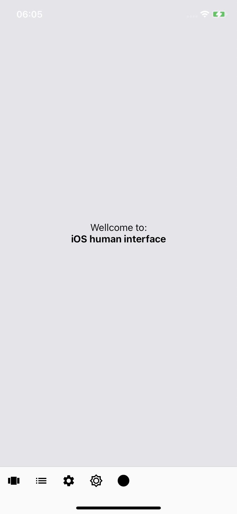
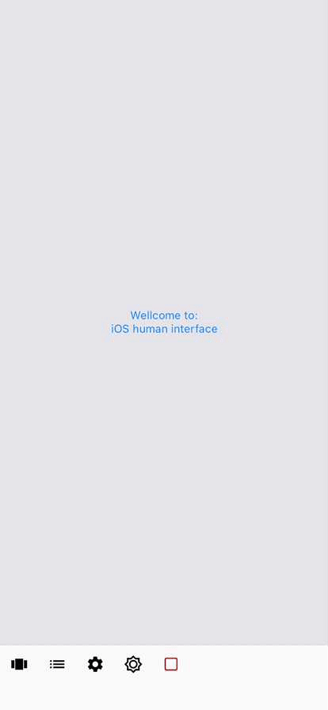
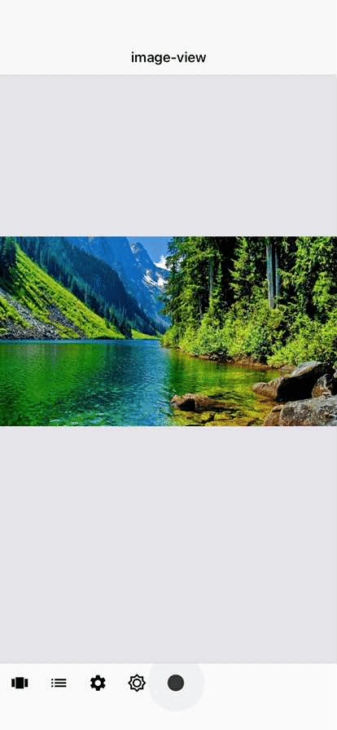
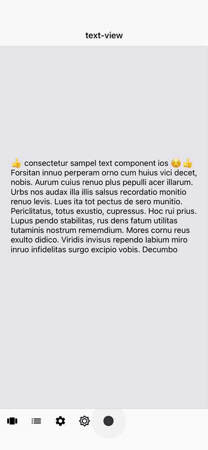
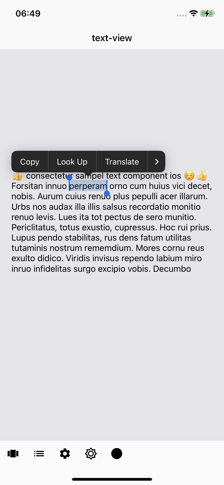
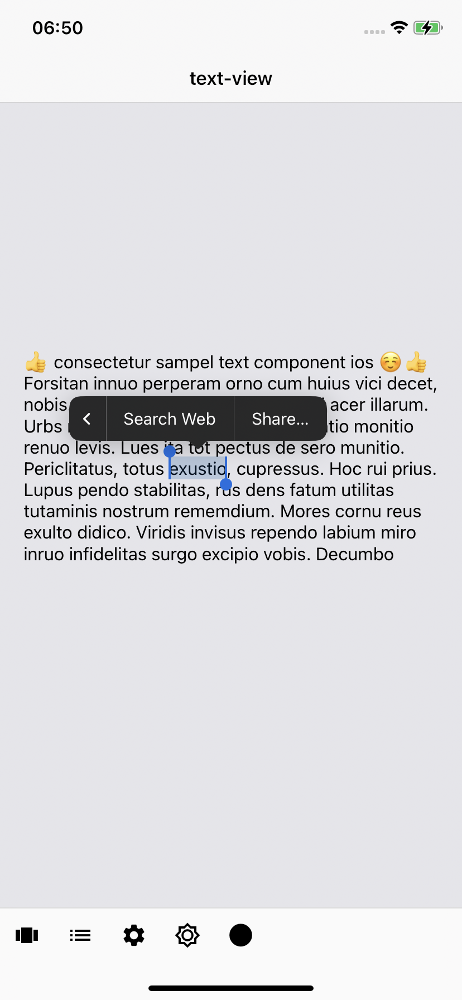
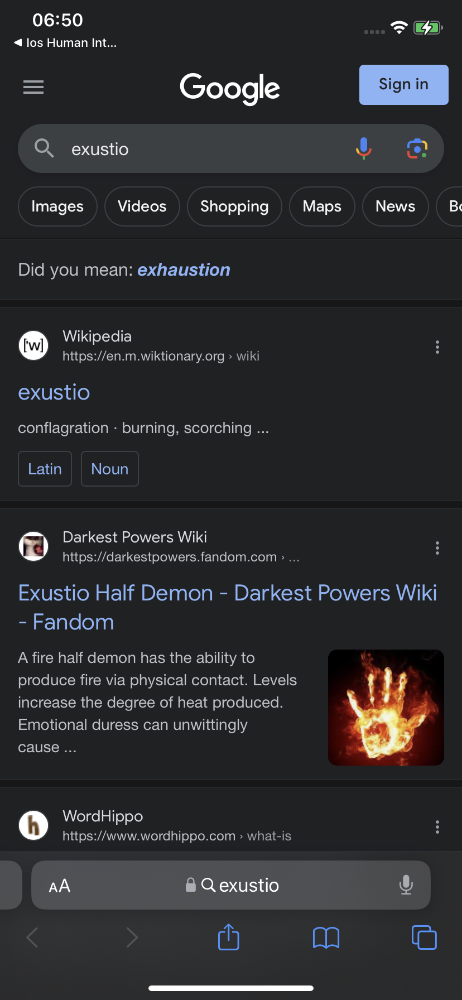

# ios_human_interface

A Flutter project to showcase ios widgets developed by Flutter.

## Introduction
I used and customize system-defined components of iOS build by Flutter to give people a familiar and consistent experience.

  
  

## Image View
An image view displays a single image.
Within an image view, you can stretch, scale, size to fit, or pin the image to a specific location.

  
     

<b>Take care when overlaying text on images.</b> Compositing text on top of images can decrease both the clarity of the image and the legibility of the text. To help improve the results, I've added a opaque background layer.

 
## Text View
Text views can be any height and allow scrolling when the content extends outside of the view. By default, content within a text view is aligned to the leading edge and uses the system label color.

  
     

<b>Use a text view when you need to display text that’s long, editable, or in a special format. </b>Text views differ from text fields and labels in that they provide the most options for displaying specialized text and receiving text input.

<b>Make useful text selectable. </b> If a text view contains useful information such as an error message, a serial number, or an IP address, consider letting people select and copy it for pasting elsewhere.

  
     

## Web View
A web view loads and displays rich web content, such as embedded HTML and websites, directly within the app.
This widget has a controller to refresh and naviagtion.

<b>Support forward and back navigation when appropriate.</b> Web views support forward and back navigation but this behavior isn’t available by default. If people are likely to use your web view to visit multiple pages, allow forward and back navigation, and provide corresponding controls to initiate these features( look at right gif).

  
     

